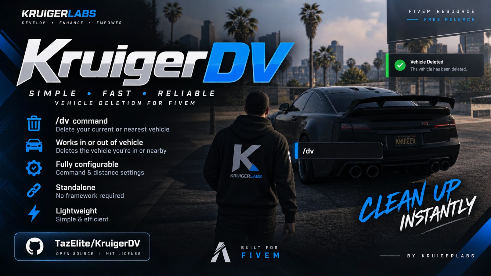

# KruigerDV — Free FiveM DV Script

KruigerDV is a lightweight **standalone FiveM DV script** that gives players a configurable `/dv` command for deleting their current vehicle or the nearest vehicle while on foot. It requires no framework and no external dependencies.

## Features
- Delete the vehicle you are currently in
- Delete the nearest vehicle when on foot
- Configurable `/dv` command
- Configurable nearby vehicle distance
- Standalone FiveM resource
- No ESX, QBCore, or other framework required
- No dependencies

## Installation
1. Download `KruigerDV`.
2. Place `kruiger_dv` in your server's `resources` folder.
3. Add `ensure kruiger_dv` to `server.cfg`.
4. Restart your server.

## Usage
Use `/dv` in-game. Edit `config.lua` to change the command, nearby vehicle distance, or whether nearby vehicles can be deleted.

## Documentation
- Full documentation: https://kruigerlabs.xyz/docs/free-scripts/kruigerdv
- FiveM scripts: https://kruigerlabs.xyz/fivem
- Documentation center: https://kruigerlabs.xyz/docs/
- FAQ: https://kruigerlabs.xyz/docs/faq

## Author
Kruiger Labs LLC (`KruigerLabs`)

## License
Licensed under the **Kruiger Labs Community License v1.0**. You may use and privately modify this resource for your own FiveM server, but redistribution, reuploading, resale, sublicensing, and claiming the work as your own are prohibited. See `LICENSE` for the complete terms.
